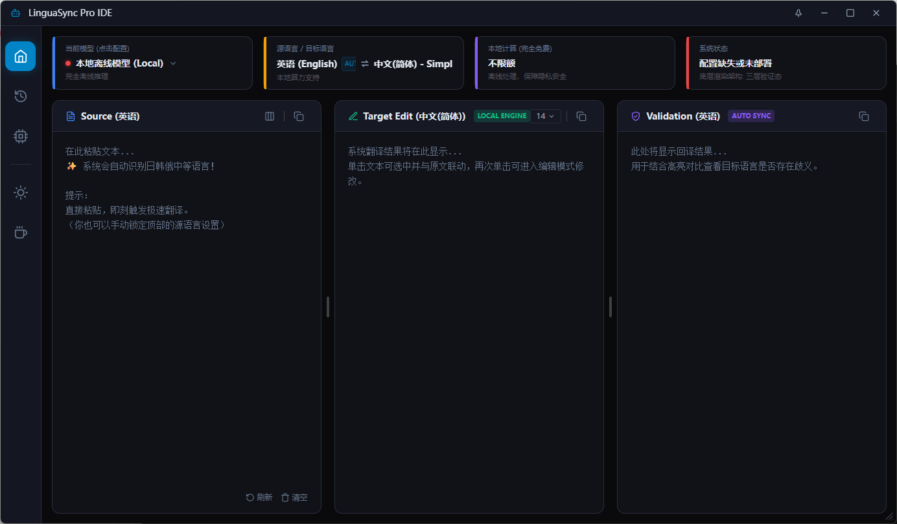
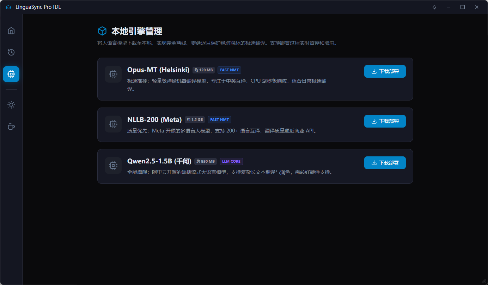
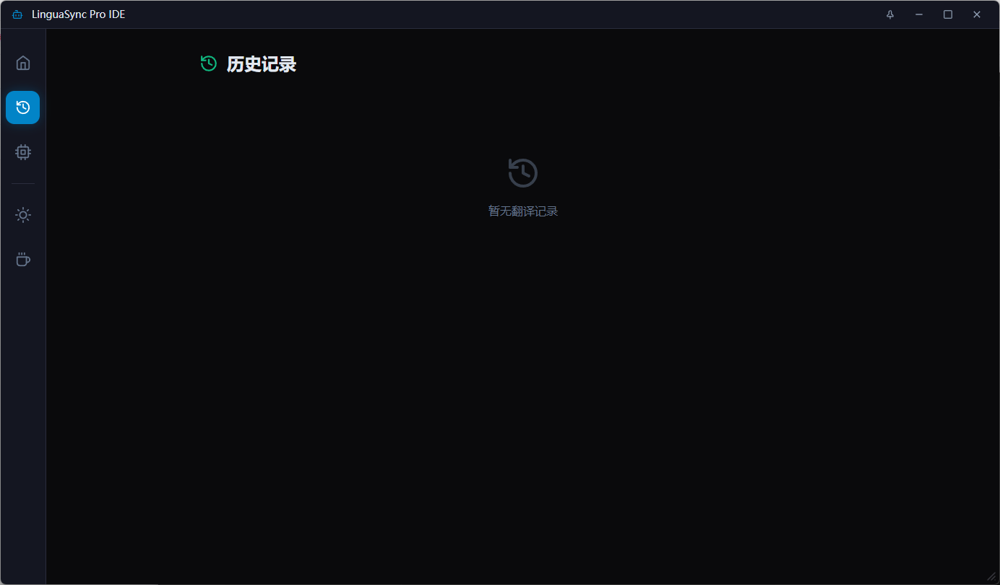

<div align="center">

# LinguaSync Pro IDE

**专业的多引擎智能翻译工具 | Professional Multi-Engine Translation Tool**

[](https://github.com/dooublemai-boop/LinguaSync)
[](LICENSE)
[](https://www.microsoft.com/windows)

*支持本地离线 AI 模型 + 多种在线翻译 API，保护您的隐私，提升翻译效率*


</div>

---

## ✨ 功能亮点

### 🤖 多引擎支持
- **本地离线模型** - 完全隐私保护，无需联网
  - `Opus-MT` (Helsinki) - 轻量级神经机器翻译，中英互译毫秒级响应
  - `NLLB-200` (Meta) - 支持 200+ 语言，翻译质量逼近商业 API
  - `Qwen2.5-1.5B` (阿里千问) - 端侧大语言模型，支持复杂文本翻译
- **在线翻译 API** - 灵活切换
  - DeepSeek / 智谱 GLM / 硅基流动 (Qwen)
  - 百度翻译 / DeepL / Google 翻译 / 腾讯翻译

### 🎯 智能翻译体验
- **三栏验证布局** - 源文本 → 目标译文 → 回译验证，确保翻译准确性
- **自动语言检测** - 智能识别日、韩、俄、中、英等语言
- **流式输出** - 大模型翻译实时显示，打字机效果
- **联动高亮** - 点击任意文本行，三栏自动同步滚动定位

### 🎨 现代化界面
- **暗色/亮色主题** - 护眼切换
- **沉浸模式** - 置顶窗口，专注翻译
- **可调节面板** - 拖拽调整三栏宽度
- **历史记录** - 本地保存翻译历史，快速回顾

---

## 📸 应用截图

> 主界面展示三栏翻译布局

| 主页翻译 | 模型管理 | 历史记录 |
|:--------:|:--------:|:--------:|
|  |  |  |

---

## 🚀 快速开始

### 方式一：直接使用安装包（推荐）

1. 前往 [Releases](https://github.com/dooublemai-boop/LinguaSync/releases) 页面
2. 下载最新版本的 `LinguaSyncPro_Setup_vX.X.X.exe`
3. 运行安装程序，按提示完成安装
4. 首次启动时可选择部署本地 AI 模型

### 方式二：从源码构建

#### 环境要求
- Python 3.10+ (推荐 3.12)
- Node.js 18+ 
- Windows 10/11

#### 构建步骤

```bash
# 1. 克隆仓库
git clone https://github.com/dooublemai-boop/LinguaSync.git
cd LinguaSync

# 2. 安装 Python 依赖
pip install pywebview pyinstaller pythonnet pystray pillow
pip install transformers torch sentencepiece jieba huggingface_hub

# 3. 构建前端
cd frontend
npm install
npm run build
cd ..

# 4. 打包应用
python -m PyInstaller LinguaSyncPro.spec

# 5. 生成安装程序（可选）
# 使用 Inno Setup 编译 build.iss
```

---

## ⚙️ 配置说明

### 在线 API 配置

1. 点击左上角「当前模型」卡片打开配置面板
2. 选择翻译平台
3. 填入对应的 API Key（百度翻译还需填写 App ID）
4. 点击保存即可开始使用

| 平台 | 免费额度 | 获取方式 |
|------|----------|----------|
| DeepSeek | 按量计费 | [获取 API Key](https://platform.deepseek.com/api_keys) |
| 百度翻译 | 100万字符/月 | [申请地址](https://api.fanyi.baidu.com/manage/developer) |
| DeepL | 50万字符/月 | [申请地址](https://www.deepl.com/pro-api) |
| 智谱 GLM | 按量计费 | [获取 API Key](https://open.bigmodel.cn/usercenter/apikeys) |
| 硅基流动 | 按量计费 | [获取 API Key](https://cloud.siliconflow.cn/account/ak) |

### 本地模型部署

1. 进入「模型中心」页面
2. 选择需要部署的模型，点击「下载部署」
3. 等待下载完成后，点击「设为当前引擎」
4. 切换到「本地离线模型」即可享受完全离线翻译

---

## 🛠️ 技术栈

| 层级 | 技术 |
|------|------|
| 前端 | React 19 + Vite + Tailwind CSS |
| 后端 | Python + pywebview |
| AI 推理 | PyTorch + Transformers (Hugging Face) |
| 打包 | PyInstaller + Inno Setup |
| 渲染引擎 | WebView2 (Edge Chromium) |

---

## 📁 项目结构

```
LinguaSync/
├── main.py                 # Python 后端主程序
├── app.ico                 # 应用图标
├── LinguaSyncPro.spec      # PyInstaller 打包配置
├── build.bat               # Windows 构建脚本
├── build.iss               # Inno Setup 安装程序配置
├── frontend/               # React 前端
│   ├── src/
│   │   ├── App.jsx         # 主组件
│   │   ├── App.css
│   │   ├── main.jsx
│   │   └── index.css
│   ├── public/
│   ├── package.json
│   └── vite.config.js
└── README.md
```

---

## 🔧 开发模式

如果需要修改前端界面：

```bash
# 1. 在 main.py 中设置开发模式
DEV_MODE = True

# 2. 启动前端开发服务器
cd frontend
npm run dev

# 3. 运行 Python 后端
python main.py
```

修改完成后：
```bash
# 构建前端
cd frontend && npm run build

# 设置回生产模式
DEV_MODE = False

# 重新打包
python -m PyInstaller LinguaSyncPro.spec
```

---

## 🤝 参与贡献

欢迎提交 Issue 和 Pull Request！

1. Fork 本仓库
2. 创建功能分支 (`git checkout -b feature/amazing-feature`)
3. 提交更改 (`git commit -m 'Add amazing feature'`)
4. 推送到分支 (`git push origin feature/amazing-feature`)
5. 创建 Pull Request

---

## 📝 更新日志

### v2.2.1 (当前版本)
- ✨ 新增三种本地 AI 模型支持（Opus-MT, NLLB-200, Qwen）
- 🎨 全新三栏翻译布局，支持回译验证
- 🌙 暗色/亮色主题切换
- 📦 模型下载支持暂停/恢复/取消
- 🔧 优化 WebView2 兼容性

---

## 📄 许可证

本项目基于 [MIT License](LICENSE) 开源。

---

## ☕ 支持开发者

如果这个项目对您有帮助，欢迎请作者喝杯咖啡！

<div align="center">

[](https://ifdian.net/a/dooublemai)

</div>

---

<div align="center">

**Made with ❤️ by [dooublemai](https://github.com/dooublemai-boop)**

</div>
